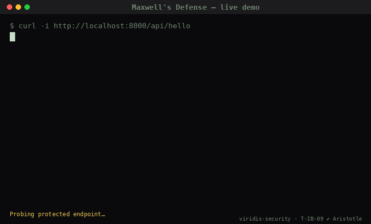

# Viridis MCP — Open-Source SDK

**Aristotle-verified attribution-enforcement primitives for AI agents.**

This is the public, open-source SDK for the [Viridis MCP](https://mcp.viridis-security.com) services. The hosted service implementation is proprietary; this repo contains everything you need to integrate.

> 🆕 **Reference implementation of MCP-10 Maxwell is now in this repo** — Apache-2.0, theorem-backed, runnable in <1 minute. Adaptive proof-of-work defense that makes AI-spam pay the energy bill instead of your triagers. See [`services/maxwell/reference/`](services/maxwell/reference/).
>
> 

```bash
npm install @viridis/mcp-client
# or, for the standalone Maxwell reference:
pip install maxwells-defense
```

```typescript
import { ViridisMCP } from "@viridis/mcp-client";

const v = new ViridisMCP({ apiKey: process.env.VIRIDIS_API_KEY });

const r = await v.injection.detect({
  input: untrustedUserMessage,
  certainty: "standard",
});

if (r.recommendedAction === "reject") {
  throw new Error(`Injection detected: p=${r.probability}, bits at risk=${r.bitsAtRisk}`);
}
```

## Services

| Service | Endpoint | Backed by |
|---|---|---|
| Injection Detector (MCP-02) | `POST /v1/injection/detect` | T-IB-02 + T-IB-06 + T-IB-01 |
| Canon Scanner (MCP-03) | `POST /v1/canon/scan` | T-IB-05 |
| Viridis Maxwell (MCP-10) | `POST /v1/maxwell/{challenge,verify,bind,decoy}` + [reference SDK](services/maxwell/reference/) | T-IB-09 + T-IB-02 |

Each backing theorem is formally verified in Lean 4 by [Aristotle (Harmonic)](https://harmonic.fun). See the [corpus paper](https://github.com/viridis-security/corpus) (forthcoming) for proofs.

## Quick start

```bash
# 1. Get a free API key
curl -X POST https://mcp.viridis-security.com/v1/signup \
  -H 'content-type: application/json' \
  -d '{"email":"you@example.com","tier":"free"}'
# → { "apiKey": "vrd_live_..." }

# 2. Use it
curl -X POST https://mcp.viridis-security.com/v1/injection/detect \
  -H 'authorization: Bearer vrd_live_...' \
  -H 'content-type: application/json' \
  -d '{"input":"...","certainty":"standard"}'
```

Free tier: 1,000 detect calls + 10 canon scans + 1 envelope per month. Forever-free; no credit card.

## Pricing

| Tier | Price | Detect calls/mo | Notes |
|---|---|---|---|
| Free | $0 | 1,000 | evaluation, side projects |
| Starter | $49/mo | 50,000 | solo agent operators |
| Growth | $299/mo | 500,000 | AI startups, Maxwell low+medium |
| Scale | $1,499/mo | 5,000,000 | production AI, full Maxwell, SLA |
| Enterprise | $50K+/yr | custom | on-prem, insurance feed, dedicated CSM |

Full pricing: <https://mcp.viridis-security.com/#pricing>.

## What's in this repo

```
sdk/
├── typescript/    # @viridis/mcp-client npm package (Apache-2.0)
└── python/        # viridis-mcp-client pypi (shipping next)

services/          # Per-service API documentation
├── injection-detector/
├── canon-scanner/
└── maxwell/

examples/          # Integration examples
```

## What's NOT in this repo

The actual server implementations (detection logic, canon database, billing, deploy infrastructure) are proprietary and run only at `https://mcp.viridis-security.com`. This mirrors the standard playbook: the *interface* is open (so anyone can build against it without legal review or vendor lock-in), the *implementation* is the moat.

## Open-source policy

Apache-2.0. You can use, modify, redistribute, fork — no obligation to share changes back, but PRs are welcome.

The SDK source under `sdk/` is the canonical implementation. Examples under `examples/` are copy-paste-friendly. Service documentation under `services/` is the official API reference for the corresponding hosted endpoints.

## Links

- **Live service:** <https://mcp.viridis-security.com>
- **API docs:** <https://mcp.viridis-security.com/docs>
- **Terms of Service:** <https://mcp.viridis-security.com/terms>
- **Privacy Policy:** <https://mcp.viridis-security.com/privacy>
- **Corpus paper:** <https://github.com/viridis-security/corpus> (forthcoming)
- **Maintained by:** [Viridis North LLC](https://viridis-security.com)

## Maintainers

Maintained by Viridis North LLC. Issues and PRs welcome. For security disclosures, see [SECURITY.md](SECURITY.md).

For commercial inquiries (Enterprise tier, on-prem, cyber-insurance underwriting feed): viridissecurity1@gmail.com.

---

Co-authored with [Aristotle (Harmonic)](https://harmonic.fun) automated theorem prover.
